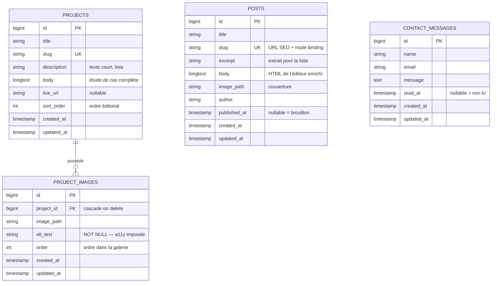
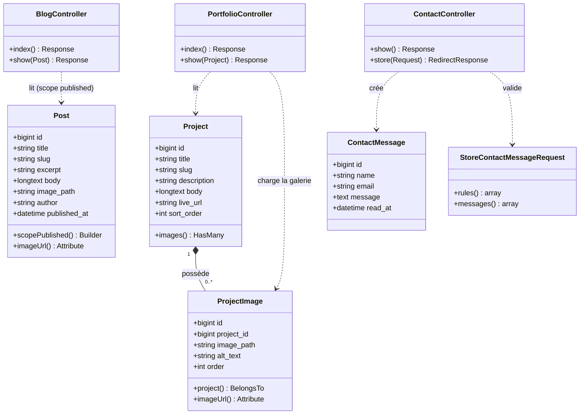

# nov-inicium 🟢

> Le site vitrine de Nov Inicium — studio de développement web basé en Belgique.
> Blog, portfolio et contact, avec l'**accessibilité (WCAG 2.1 AA / EAA)** comme
> exigence non négociable dès la conception.

**Site d'entreprise — Laravel 12 · Vue 3 · Inertia.js**

Ce dépôt contient le site public de Nov Inicium : une vitrine où les visiteurs
consultent les articles de blog, parcourent les projets réalisés (avec galeries
de captures d'écran) et prennent contact. Le contenu est géré via un panneau
d'administration Filament, sans toucher au code.

L'accent du projet n'est pas la nouveauté fonctionnelle — un blog et un portfolio
sont des classiques — mais **la rigueur du modèle relationnel** et une
**accessibilité réelle, testée**, pas déclarative.

---

## ✨ Fonctionnalités

### Site public

- **Landing** — présentation du studio, services, appels à l'action
- **Blog** — liste paginée et articles détaillés (slug SEO, image de couverture, auteur, date)
- **Portfolio** — projets avec **galerie de captures d'écran navigable au clavier**
- **Contact** — formulaire **entièrement accessible** (labels liés, erreurs annoncées, focus géré)
- **Étiquettes visuelles** superposées aux images (catégorie + marque), en HTML réel, pas gravées dans l'image

### Administration (Filament)

- **CRUD complet** pour les articles et les projets
- **Éditeur de texte enrichi** (gras, italique, titres H2/H3, listes, citations)
- **Galerie d'images** par projet via *relation manager*, avec **texte alternatif obligatoire**
- **Génération automatique du slug** depuis le titre
- **Boîte de réception** des messages de contact
- **Inscription publique désactivée** — un seul administrateur, créé manuellement

---

## ♿ Accessibilité — le cœur du projet

L'accessibilité est traitée comme une contrainte d'architecture, pas comme une
finition. Implémentée et vérifiée :

- **HTML sémantique** : `header` / `nav` / `main` / `article` / `footer`, un seul `h1` par page, hiérarchie de titres respectée
- **Navigation clavier complète** : lien d'évitement (*skip to main content*), ordre de tabulation logique, aucun piège au clavier
- **Focus visible** sur tous les éléments interactifs (anneau 3px, adapté aux fonds clairs, verts et sombres)
- **Formulaire de contact** : chaque champ a un `label` lié (`for`/`id`), les erreurs utilisent `aria-invalid` + `aria-describedby`, un résumé d'erreurs `role="alert"` **reçoit le focus** après échec, le succès est annoncé via `role="status"`
- **Galerie** : les vignettes sont de vrais `<button>` (opérables au clavier par défaut), l'état actif exposé via `aria-pressed`, chaque changement annoncé par une région `aria-live="polite"`
- **Contraste** : toutes les paires de couleurs utilisées atteignent **AA ou mieux** (ratios documentés dans `brand.css`). Écarts volontaires par rapport à la charte : le gris `#8A8A8A` n'est **jamais** utilisé pour du texte (3,5:1, échoue), le vert n'est jamais une couleur de texte sur blanc
- **`prefers-reduced-motion`** respecté : animations et transitions neutralisées
- **Texte alternatif imposé au niveau du schéma** : la colonne `alt_text` est `NOT NULL` — une image ne peut pas entrer dans la base sans description

> Le `alt_text` obligatoire en base est le meilleur exemple de la philosophie du
> projet : l'accessibilité n'est pas laissée à la discipline de l'éditeur, elle
> est **garantie par la structure de données**.

---

## 🛠️ Stack technique

| Couche | Technologie |
|--------|-------------|
| Backend | Laravel 12 (PHP 8.4), Eloquent ORM |
| Pont | Inertia.js |
| Frontend | Vue 3 (Composition API, `<script setup lang="ts">`), TypeScript |
| UI | TailwindCSS |
| Administration | Filament 4 |
| Authentification | Laravel Fortify (inscription désactivée) |
| Base de données | MySQL (dev via Laravel Herd) — migrations compatibles PostgreSQL |
| Routes typées | Wayfinder |

---

## 🗄️ Modèle de données

### Diagramme entité-relation (ERD)



> `posts` et `contact_messages` sont **volontairement indépendants** des comptes
> utilisateurs : le contenu public et les messages entrants survivent aux comptes.
> `project_images` est la seule relation (**1-N**) : un projet possède plusieurs
> captures, chacune portant son propre `alt_text` et son `order`. Une table séparée
> (plutôt qu'une colonne JSON) donne l'intégrité référentielle, la suppression en
> cascade et un texte alternatif contraint au niveau du schéma.

### Diagramme de classe (UML)



> **Composition (losange plein)** : une image de projet ne survit pas au projet
> (`ON DELETE CASCADE`).
> **Dépendance (pointillés)** : les contrôleurs lisent les modèles et délèguent la
> validation à une *Form Request*.

---

## 📐 Tables & décisions de schéma

### `posts`
Un article. `slug` porte une contrainte d'unicité — les URL en double sont
impossibles au niveau du SGBD, pas seulement applicatif. `published_at` **nullable
fait office d'indicateur de brouillon** (`NULL` = brouillon) : pas de booléen
séparé qui pourrait se désynchroniser de la date. Le `scopePublished()` ne
renvoie que les articles dont la date est passée — les brouillons restent privés
même si l'on devine le slug. `body` stocke du HTML issu de l'éditeur enrichi ;
l'accesseur `imageUrl()` normalise les chemins d'images (contenu *seedé* vs
téléversé via Filament).

### `projects`
Un projet du portfolio. `description` = texte court de la carte ; `body` = étude
de cas complète. `sort_order` permet un ordre **éditorial** plutôt que par date
de création.

### `project_images`
Relation **1-N** avec `projects`. Table séparée (et non colonne JSON) car chaque
image porte ses propres données : `alt_text` **contraint `NOT NULL`** (une image
sans description ne peut pas exister) et `order` pour l'ordre dans la galerie.
La première image par `order` sert automatiquement de couverture.

### `contact_messages`
Messages du formulaire de contact. `read_at` nullable (`NULL` = non lu) prépare
une future boîte de réception.

### Contraintes garanties
- `ON DELETE CASCADE` sur `project_images.project_id` : supprimer un projet efface ses images.
- `alt_text NOT NULL` : accessibilité imposée par le schéma, pas par la vigilance de l'éditeur.
- Slugs uniques : URL SEO stables, *route model binding* par slug.
- Les brouillons (`published_at` nul ou futur) ne sont jamais servis publiquement.
- Validation du formulaire de contact déléguée à une *Form Request* avec messages lisibles.

> Le schéma est en **troisième forme normale (3NF)**.

---

## 🔄 Cycle d'une soumission de contact

```
1. Vue : useForm.post('/contact')  →  validation côté serveur (StoreContactMessageRequest)
2. Échec ? → les erreurs reviennent, le focus se déplace vers le résumé role="alert"
             chaque erreur pointe vers son champ (aria-describedby + aria-invalid)
3. Succès ? → INSERT contact_message, onSuccess réinitialise le formulaire
              et affiche une confirmation annoncée via role="status"
```

Le succès est suivi **côté client** (`onSuccess`) et annoncé par une région
`role="status"` — volontairement indépendant des *flash props* partagées du kit,
pour que l'accessibilité ne dépende pas d'un middleware externe.

---

## 🎨 Charte visuelle

| Rôle | Couleur | Contraste vérifié |
|------|---------|-------------------|
| Vert de marque | `#BEEF35` | fond uniquement (texte sombre dessus : 8,2:1) |
| Gris de marque | `#353535` | texte principal sur blanc : 12,6:1 |
| Texte atténué | `#5A5A5A` | 7,0:1 (remplace `#8A8A8A` qui échoue à 3,5:1) |

Les jetons de couleur et leurs ratios sont documentés dans `resources/css/brand.css`.

---

## 🚀 Installation

```bash
# Cloner et installer les dépendances
git clone https://github.com/buhovac/novinicium.git
cd novinicium
composer install
npm install

# Configuration
cp .env.example .env
php artisan key:generate

# Configurer la base MySQL dans .env, puis :
php artisan migrate
php artisan db:seed --class=SiteContentSeeder

# Lien symbolique pour les images téléversées
php artisan storage:link

# Créer l'administrateur (accès au panneau Filament)
php artisan make:filament-user

# Générer les routes typées puis lancer
php artisan wayfinder:generate
npm run dev
```

Développé avec [Laravel Herd](https://herd.laravel.com/), accessible sur
`https://novinicium.test`. L'administration est sur `/admin`.

---

## ⚙️ Configuration requise

- PHP 8.4+
- Node.js 20+
- MySQL 8+ (ou PostgreSQL — migrations compatibles)

---

## 📁 Structure du projet

```
app/
├── Http/
│   ├── Controllers/
│   │   ├── BlogController.php        # liste + article (scope published)
│   │   ├── PortfolioController.php   # liste + projet avec galerie
│   │   └── ContactController.php     # affichage + enregistrement
│   └── Requests/
│       └── StoreContactMessageRequest.php   # validation + messages lisibles
├── Models/
│   ├── Post.php                      # scopePublished(), imageUrl()
│   ├── Project.php                   # images() HasMany
│   ├── ProjectImage.php              # project() BelongsTo, imageUrl()
│   └── ContactMessage.php
└── Filament/
    └── Resources/                    # CRUD admin (Posts, Projects, ContactMessages)

resources/
├── css/
│   └── brand.css                     # jetons de marque + utilitaires a11y
└── js/
    ├── layouts/
    │   └── PublicLayout.vue          # skip link, landmarks, navigation
    └── pages/
        ├── Home.vue
        ├── Blog/{Index,Show}.vue
        ├── Portfolio/{Index,Show}.vue    # Show = galerie accessible
        └── Contact.vue               # formulaire accessible

database/
├── migrations/                       # posts, projects, project_images, contact_messages
└── seeders/
    └── SiteContentSeeder.php         # contenu réel + textes alternatifs
```

> **Note d'architecture** : ce site est construit par-dessus le *Vue starter kit*
> de Laravel. Les pages publiques déclarent explicitement `null` comme layout dans
> `app.ts` afin d'utiliser leur `PublicLayout` plutôt que le layout applicatif du
> kit (réservé à l'administration authentifiée).

---

## 🎓 Contexte

Projet réalisé pour Nov Inicium (SRL). L'objectif technique : un site vitrine
maintenable dont **l'accessibilité est vérifiable** (audit Lighthouse, navigation
clavier, lecteur d'écran), en vue de la conformité à l'**European Accessibility
Act**. Assistance IA utilisée pour la génération de code, le débogage et la
rédaction.
